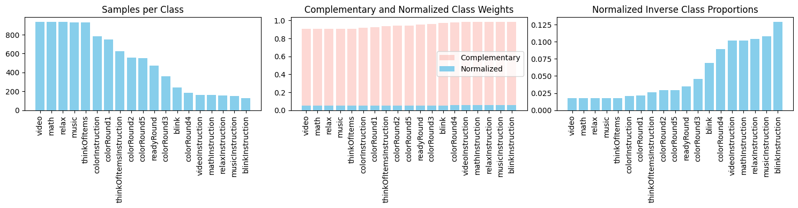
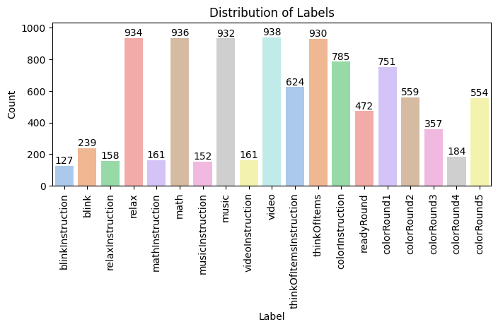
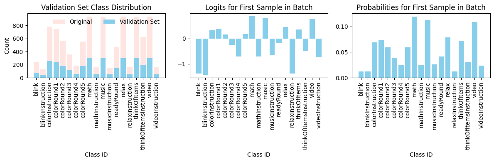
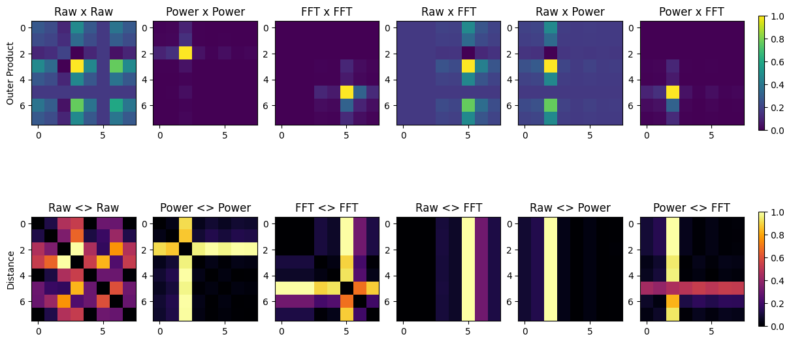
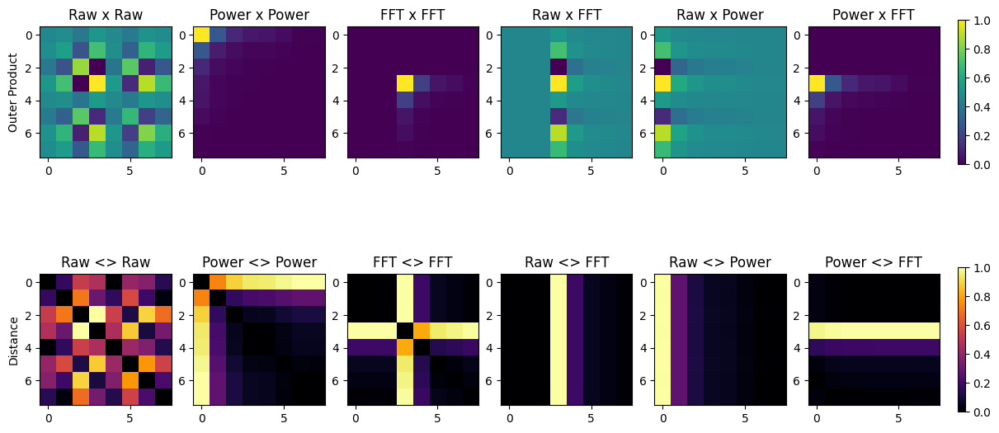

# EEG: ElectroEncephaloGram

A practical EEG classification project focused on turning raw synchronized biosignals into leakage-safe training splits and reproducible model evaluation artifacts.

Dataset source: UC Berkeley (Berkeley BioSense), [available on Kaggle](https://www.kaggle.com/datasets/berkeley-biosense/synchronized-brainwave-dataset).

## Project overview

This repository contains an end-to-end workflow for EEG-oriented signal classification:

- Data ingestion from synchronized sensor exports.
- Preprocessing and feature engineering.
- Subject-aware splitting to reduce leakage risk.
- Model training and evaluation with saved reports and plots.

The main goal is not only to train a classifier, but also to keep the pipeline transparent enough to diagnose failure modes (class imbalance, subject shift, and low-support labels).

## Workflow Starter

- [EEG data science playbook](docs/eeg-data-science-playbook.md)
- [Model report template](templates/model-report-template.md)

## Step-by-step quick start

1. Read the playbook and lock your prediction target plus split strategy.
2. Use the model report template to define experiment metadata before training.
3. Run preprocessing to build clean and split-ready features.
4. Train and evaluate with group-aware validation.
5. Record per-subject performance, confidence intervals, and failure modes.

## Reproducible pipeline

### 1) Preprocess and split

```bash
python scripts/preprocess_and_split.py --drop-unlabeled
```

This step generates leakage-safe datasets and summary metadata:

- outputs/processed/features_with_split.csv
- outputs/processed/train.csv
- outputs/processed/val.csv
- outputs/processed/test.csv
- outputs/processed/summary.json

### 2) Train and evaluate

```bash
python scripts/train_groupkfold_eval.py
```

This step writes model metrics and evaluation summaries under outputs/reports.

## Dataset limitations to keep in mind

- Extremely imbalanced multiclass target.
  - Train imbalance is about 31.6x (largest vs smallest class), and many classes have very few examples. That crushes macro F1 even with class weights.
- Too many classes for the available per-class signal.
  - Solving a large multiclass problem with sparse support in many labels, so each one-vs-rest boundary is weak.
- Group split is correct but makes generalization harder.
  - Training on 21 subjects and tested on 5 unseen subjects. That is the right leakage-safe evaluation, but subject shift is large in EEG.
- Features are coarse summaries.
  - Current features are aggregate stats + bandpower snapshots. They may not capture temporal dynamics that separate many fine-grained labels

## Sample results

The figures below provide a quick snapshot of what the trained pipeline is compensating for and how it performs.

### Class weights



Why it matters: this plot highlights how strongly minority classes must be upweighted so the loss function does not ignore them.

### Label distribution



Why it matters: this distribution makes the long-tail label problem explicit and explains why macro-level metrics are difficult to optimize.

### Model output sample



Why it matters: this example output shows the practical classification behavior of the developed model on the prepared feature pipeline.

## IMAGINATION

Imagination converts EEG raw values, statistical features, power bands, and Fourier transforms into visual representations. Then, trains a convolutional neural network to classify these images into mental states. The goal is to leverage spatial patterns in the data that may be more easily captured by CNNs.

Class: Relax



Class: Video


